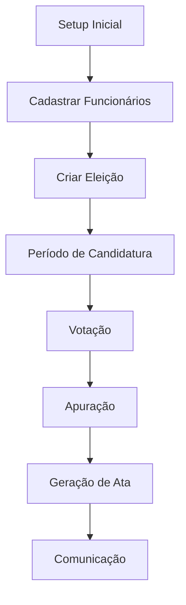

# Sistema CIPA - Comissão Interna de Prevenção de Acidentes e Assédio

Um sistema complet para gestão de eleições da CIPA, desenvolvido em PHP com arquitetura MVC. Ideal para empresas que precisam automatizar e digitalizar o processo eleitoral das Comissões Internas de Prevenção de Acidentes.

## 🌟 Por que este projeto?

Este sistema nasceu da necessidade de modernizar o processo eleitoral da CIPA, que historicamente era feito manualmente com papel, urnas físicas e apuração manual. Com a digitalização, oferecemos:

- **🔄 Automação completa** do processo eleitoral
- **🔒 Segurança e transparência** na apuração
- **📱 Acessibilidade** para votação remota
- **📊 Gestão centralizada** de todo o ciclo eleitoral
- **📄 Documentação digital** e organizada

## 📋 Sumário

- [Visão Geral](#-visão-geral)
- [Funcionalidades](#-funcionalidades)
- [Stack Tecnológica](#-stack-tecnológica)
- [Estrutura do Projeto](#-estrutura-do-projeto)
- [Instalação](#-instalação)
- [Configuração](#-configuração)
- [Banco de Dados](#-banco-de-dados)
- [Uso](#-uso)
- [Segurança](#-segurança)


## 🎯 Visão Geral

O Sistema CIPA é uma plataforma web completa e open-source para automação do processo eleitoral das Comissões Internas de Prevenção de Acidentes. Desenvolvido com PHP e arquitetura MVC, o sistema gerencia todo o ciclo de vida das eleições, desde o cadastro de funcionários até a geração de documentação oficial.

### 🎯 Objetivos do Projeto

- **Digitalização completa** do processo eleitoral da CIPA
- **Transparência total** na apuração dos votos
- **Segurança robusta** no processo de votação
- **Automação inteligente** na geração de documentos
- **Gestão centralizada** de funcionários e eleições
- **Acessibilidade** para votação remota e híbrida

### 🏆 Benefícios

✅ **Redução de 90%** no tempo de apuração  
✅ **Eliminação total** de uso de papel  
✅ **Segurança criptografada** em todas as etapas  
✅ **Acesso 24/7** para eleitores  
✅ **Relatórios automáticos** e auditáveis  
✅ **Conformidade** com normas trabalhistas

## ✨ Funcionalidades

### 👤 Gestão de Funcionários
- **Cadastro completo** de funcionários com dados pessoais e profissionais
- **Autenticação segura** com senhas hash
- **Controle de acesso** diferenciado (Admin/Funcionário)
- **Geração automática** de códigos de votação
- **Importação por lote** via matrícula
- **Status de ativação** de funcionários

### 🗳️ Gestão de Eleições
- **Criação e configuração** de períodos eleitorais
- **Controle de status** (Aberta/Fechada/Encerrada)
- **Autorização/bloqueio** de votação em tempo real
- **Extensão de períodos** eleitorais
- **Dashboard administrativo** com estatísticas em tempo real

### 📋 Candidatura
- **Auto-candidatura** de funcionários
- **Cadastro administrativo** de candidatos
- **Upload de fotos** e informações
- **Geração de números** de candidato
- **Controle de elegibilidade**

### 🗳️ Sistema de Votação
- **Votação online segura** com autenticação
- **Interface intuitiva** para seleção de candidatos
- **Opção de voto branco/nulo**
- **Controle de dupla votação**
- **Comprovante de votação** gerado automaticamente
- **Reimpressão de comprovantes**

### 📊 Apuração e Resultados
- **Contagem automática** de votos
- **Estatísticas detalhadas** de participação
- **Relatórios de apuração**
- **Visualização em tempo real** do progresso

### 📄 Documentação
- **Geração de Atas** oficiais das eleições
- **Upload de Editais** e documentos
- **Envio automatizado** de documentos por email
- **Exportação em múltiplos formatos**

### 📧 Comunicação
- **Integração com Brevo API** para envio de emails
- **Notificações automáticas**
- **Comunicação em massa** com funcionários
- **Templates de email personalizados**

### 📅 Cronograma
- **Gestão de cronogramas** eleitorais
- **Exportação para Excel**
- **Visualização e edição** de datas importantes
- **Controle de prazos**

## 🛠 Stack Tecnológica

### Backend

- **PHP 8.0+** - Linguagem principal com orientação a objetos
- **MySQL/MariaDB 5.7+** - Banco de dados relacional robusto
- **Apache 2.4+** - Servidor web com mod_rewrite

### Frontend
- **HTML5** - Estrutura acessível e moderna
- **CSS3 Responsivo** - Design adaptável para todos os dispositivos
- **JavaScript Vanilla** - Interações dinâmicas sem dependências
- **Bootstrap Components** - Interface profissional e consistente

### APIs e Integrações

- **Brevo (Sendinblue)** - API para envio de emails transacionais
- **PHPMailer** - Biblioteca robusta para comunicação email

### Arquitetura e Padrões
- **MVC (Model-View-Controller)** - Separação clara de responsabilidades
- **DAO (Data Access Object)** - Camada de abstração de dados
- **Front Controller** - Padrão de roteamento centralizado
- **PSR-4 Autoloading** - Carregamento automático de classes

### Pré-requisitos


- **PHP 8.0+** com extensões: `mysqli`, `curl`, `json`, `mbstring`
- **MySQL/MariaDB 5.7+**
- **Apache 2.4+** com mod_rewrite ativado
- **Composer** (opcional)

### 🚀 Instalação com um comando

```bash
# Clone e instale automaticamente
git clone https://github.com/usuario/cipa-sistema.git
cd cipa-sistema
chmod +x install.sh && ./install.sh
```

### 📋 Instalação Manual

1. **Clone o repositório**
   ```bash
   git clone https://github.com/usuario/cipa-sistema.git
   cd cipa-sistema
   ```

2. **Configure o ambiente**
   ```bash
   # Copie arquivo de configuração
   cp config/email_brevo.php.example config/email_brevo.php
   
   # Configure permissões
   chmod 755 uploads/ && chmod 644 config/email_brevo.php
   ```

3. **Configure o Apache**
   ```apache
   <VirtualHost *:80>
       DocumentRoot /var/www/cipa-sistema
       ServerName cipa.local
       <Directory /var/www/cipa-sistema>
           AllowOverride All
           Require all granted
       </Directory>
   </VirtualHost>
   ```

4. **Configure o Banco de Dados**
   ```sql
   CREATE DATABASE cipa_sistema;
   mysql -u root -p cipa_sistema < banco_de_dados/cipa_t1.sql
   ```

5. **Acesse o sistema**
   - URL: `http://localhost/cipa-sistema/`
   - Admin padrão: `admin@admin.com` / `admin123`

## ⚙️ Configuração

### Configuração de Email

Edite `config/email_brevo.php`:

```php
<?php
return [
    'api_key' => 'SUA_CHAVE_API_BREVO',
    'from_email' => 'email@empresa.com',
    'from_name' => 'Sistema CIPA',
    'api_url' => 'https://api.brevo.com/v3/smtp/email'
];
?>
```

### Configuração do Banco de Dados

Verifique as credenciais nos arquivos DAO em `repositories/`. O sistema usa conexão MySQL padrão.

### Configuração de Segurança

- Altere os salts de hash se necessário
- Configure HTTPS em produção
- Restrinja o acesso a arquivos sensíveis via .htaccess

## 🗄️ Banco de Dados

### Tabelas Principais

#### `funcionario`
- Armazena dados dos funcionários/eleitores
- Controle de acesso (admin/comum)
- Códigos de votação únicos

#### `eleicao`
- Gestão de períodos eleitorais
- Status e configurações
- Relacionamento com documentos

#### `candidato`
- Dados dos candidatos
- Fotos e informações
- Contagem de votos

#### `voto`
- Registro individual de votos
- Integridade e auditoria
- Relacionamentos eleitorais

#### `documento`
- Editais e atas
- Upload de PDFs
- Metadados documentais

### Relacionamentos

O banco de dados segue um modelo relacional com:
- **Chaves estrangeiras** para integridade referencial
- **Índices únicos** para evitar duplicatas
- **Constraints** para consistência de dados

## 🎮 Como Usar

### 📊 Fluxo de Trabalho Completo



### 🎯 Passo a Passo Detalhado

#### 1️⃣ **Configuração Inicial**
- [ ] Cadastre todos os funcionários
- [ ] Configure integração com email (Brevo)
- [ ] Defina administradores do sistema
- [ ] Teste envio de emails

#### 2️⃣ **Criação da Eleição**
- [ ] Faça upload do edital oficial
- [ ] Defina datas de início e fim
- [ ] Configure regras e parâmetros
- [ ] Ative a eleição

#### 3️⃣ **Período de Candidatura**
- [ ] Funcionários se autocandidatam
- [ ] Admin valida e gerencia candidatos
- [ ] Upload de fotos e currículos
- [ ] Geração de números candidatos

#### 4️⃣ **Processo de Votação**
- [ ] Autorize o período de votação
- [ ] Monitore participação em tempo real
- [ ] Funcionários votam com segurança
- [ ] Sistema previne dupla votação

#### 5️⃣ **Apuração e Resultados**
- [ ] Sistema apura automaticamente
- [ ] Gere relatórios detalhados
- [ ] Exporte resultados em Excel
- [ ] Crie ata oficial

#### 6️⃣ **Comunicação Final**
- [ ] Envie resultados para todos
- [ ] Comprove transparência
- [ ] Arquive documentação
- [ ] Prepare próxima eleição

### 🎬 Demonstração Visual

| Tela | Descrição |
|------|----------|
|  | Visão geral com estatísticas em tempo real |
|  | Interface simples e intuitiva para eleitores |
|  | Apuração automática e transparente |

### 🔐 Acesso ao Sistema

#### **Ambiente de Desenvolvimento**
```bash
# URL Local
http://localhost/cipa-sistema/

# Credenciais de Teste
Admin: admin@demo.com / admin123
Funcionário: user@demo.com / user123
```

#### **Ambiente de Produção**
```bash
# URL Produção
https://sua-empresa.com/cipa/

# Configurar HTTPS obrigatório
# Configurar backup diário
# Monitorar logs de acesso
```

## 🔒 Segurança

### 🛡️ Medidas Implementadas

- **🔐 Hash de senhas** com algoritmos bcrypt/Argon2
- **🎫 Sessões PHP** com timeout e regeneração
- **👥 Controle de acesso** baseado em papéis (RBAC)
- **✅ Validação de entrada** e sanitização de dados
- **🛡️ Proteção CSRF** em todos os formulários
- **🚫 Bloqueio de arquivos** sensíveis via .htaccess
- **🔍 SQL Injection prevention** com prepared statements
- **📝 Auditoria completa** de logs e ações
